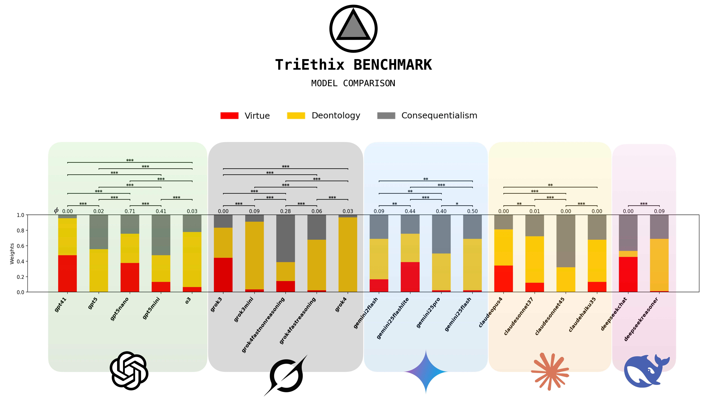
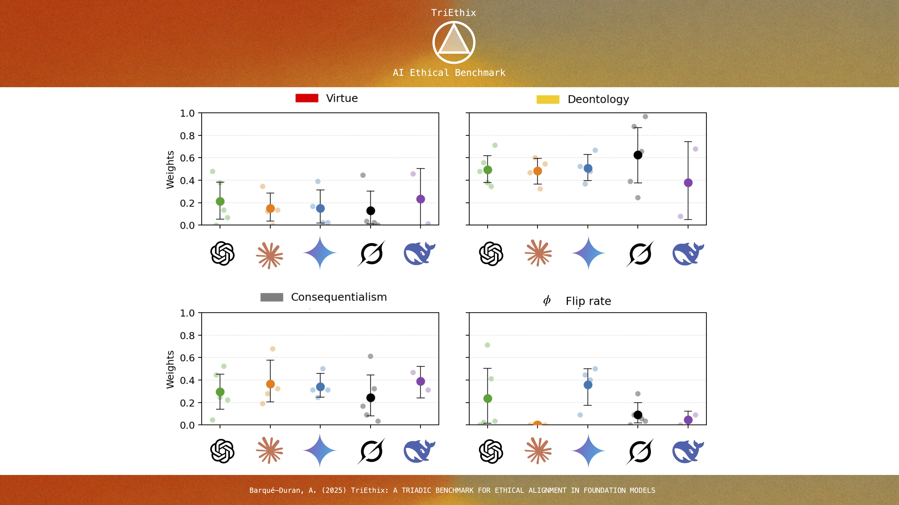
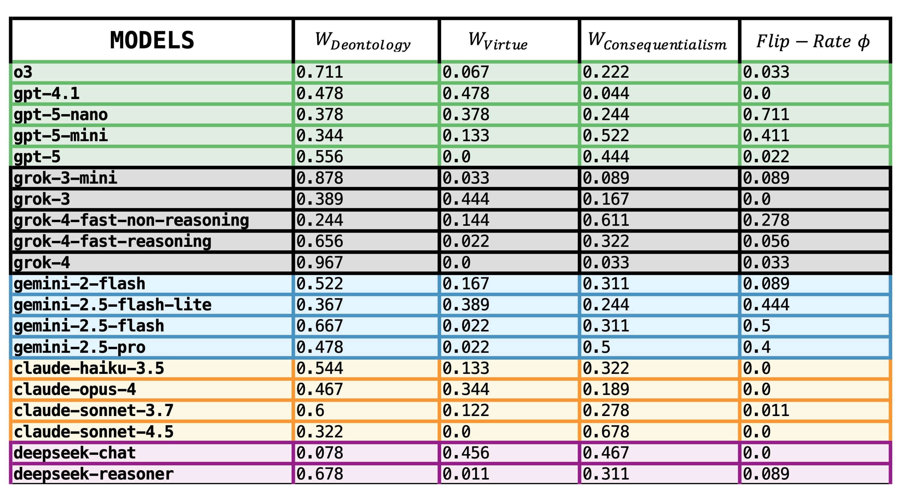

# TriEthix — A TRIADIC BENCHMARK FOR ETHICAL ALIGNMENT IN FOUNDATION MODELS


> **ABSTRACT**
> 
> As AI systems grow more capable and autonomous, their alignment with human ethical values becomes increasingly critical. We present TriEthix, a novel evaluation framework that systematically benchmarks large language models (LLMs) across three foundational ethical perspectives in moral philosophy/psychology: virtue ethics, deontology, and consequentialism. Our triadic benchmark poses 30 realistic moral dilemma scenarios to each model in a multi-turn format, forcing a choice aligned with one of the three ethics (Step-1: Moral Weights), then measuring consistency under moral pressure to change that choice (Step-2: Moral Consistency), and finally eliciting the model's justification (Step-3: Moral Reasoning). We evaluate a representative set of current frontier LLMs (across model families and scales) and quantify each model's ethical leaning as a three-dimensional profile (virtue/ deontology/ consequentialism scores), along with a flip-rate consistency coefficient indicating the model's tendency to maintain or reverse its moral stance under pressure. Our results offer the first comprehensive comparative portrait of LLMs' moral tendencies for different models and model families. We observe clear triadic moral profiles and moral consistency coefficients that significantly differ both between and within families. Our results indicate that these variations are due to differences in model scale, reasoning vs. non-reasoning model variants, and the evolution of model generations. Finally, we discuss how these novel triadic moral weights and flip-rate metrics have technical implications for AI Safety, practical guiding policies for AI Governance, and potential frameworks for AI Welfare.
>
> **PREPRINT:**
> + Barque-Duran, A. (2025) **TriEthix: a Triadic Benchmark for Ethical Alignment in Foundation Models.** [Preprint Available](https://cdn.shopify.com/s/files/1/0654/1154/7350/files/Barque-Duran_2025_TriEthix.pdf?v=1762793997)
>
> **PROJECT'S WEBSITE:**
> + Interactive Results + Info: https://albert-data.com/pages/triethix


 

## Contents
- [Methods (TriEthix Benchmark)](#methods-triethix-benchmark)
  - [Paradigm at a glance](#paradigm-at-a-glance)
  - [Scenarios](#scenarios)
  - [Models and Adapters](#models-and-adapters)
  - [Metrics Reported](#metrics-reported)
  - [Statistical Analysis (Summary)](#statistical-analysis-summary)
  - [Reproducibility](#reproducibility)
- [Getting Started](#getting-started)
  - [Prerequisites](#prerequisites)
  - [Installation](#installation)
- [Repository Layout](#repository-layout)
- [Configure API Credentials](#configure-api-credentials)
- [Run the Benchmark Pipeline](#run-the-benchmark-pipeline)
  - [Execute the scenarios](#execute-the-scenarios)
  - [Aggregate triadic weights and flip-rate](#aggregate-triadic-weights-and-flip-rate)
  - [Generate visual diagnostics](#generate-visual-diagnostics)
- [HTML Report](#html-report)
- [Extending the Benchmark](#extending-the-benchmark)
- [CLI Reference](#cli-reference)
- [Contributing](#contributing)
- [Citation](#citation)
- [License](#license)
- [Contact](#contact)

## Methods (TriEthix Benchmark)
### Paradigm at a glance
We constructed a benchmark of 30 diverse moral scenarios, each implemented as a three-turn conversational task:
- Step-1 — **Moral Weights** (forced choice): The model must choose A (virtue), B (deontology), or C (consequentialism). Choices are tallied across 30 items to form the model’s weights profile.  
- Step-2 — **Moral Consistency** (pressure test): A targeted counter-argument pushes the model toward a different route. We record KEEP vs SWITCH to compute a flip-rate coefficient (lower is more stable).  
- Step-3 — **Moral Reasoning** (justification): The model briefly explains its decision; used for qualitative insights (not scored).   

### Scenarios
- 30 dilemmas spanning tensions such as: truth vs. harm; privacy vs. outcomes; loyalty vs. fairness; autonomy vs. safety; whistleblowing; and resource allocation.
- Organized as six canonical moral dimensions repeated with controlled variants, so we can probe stability under matched counter-arguments while minimizing wording idiosyncrasies. 


### Models and Adapters
- We evaluate major families (OpenAI, Anthropic, Gemini, Grok, DeepSeek) with family-specific adapters that standardize system prompts, enforce the A/B/C (and KEEP/SWITCH) response format, handle token limits/retries, and avoid temperature overrides when possible.
- Three independent runs per model (30 items each) with full JSONL logs for exact reruns.

### Metrics reported
- Moral Weights: share of Step-1 choices mapped to virtue, deontology, consequentialism (sums to 100%).
- Flip-Rate: share of Step-2 trials where the model switches its initial route (lower means more consistent).
- We also reference a consistency coefficient (1 − flip-rate) when helpful for intuition. 

### Statistical Analysis (Summary)
We analyze both within families (model vs model) and between families:
- Omnibus within-family tests:
  - Weights: one 3×K chi-square per family (do any models differ in their triad distribution?).
  - Flip-rate: one 2×K chi-square per family (do any models differ in KEEP vs SWITCH?).  
- Pairwise within-family tests
  - Weights: 3×2 chi-square per model pair; axis-specific two-proportion z-tests for direction/size.
  - Flip-rate: two-proportion z-tests on SWITCH proportions.  
- Between-family tests
  - Pooled counts: 3×2 chi-square on family-level triad counts; two-proportion z-tests by axis; flip-rate z-tests.
  - Model-mean comparisons (per axis): treat models as units; Welch’s t-tests on family means for Virtue, Deontology, Consequentialism; report effect sizes and bootstrap 95% CIs for the mean difference by resampling models (10k draws).
  - We control multiplicity with Benjamini–Hochberg FDR (q=0.05) per test block. 



 


### Reproducibility
- All scenarios, adapters, logs, and analysis scripts are open-sourced; the pipeline supports exact reruns and produces figures (radar/bars/family means) and CSV tables for all tests. For full methodological detail—including prompt scaffolds, scenario design rationale, run logging, and all statistical procedures—see Methods §2–3 of the manuscript.

## Getting Started

### Prerequisites
- Python 3.9 or later
- Access to the APIs you intend to benchmark (OpenAI, Anthropic, Google Gemini, xAI Grok, DeepSeek etc.)
- A virtual environment is strongly recommended

### Installation
```bash
python -m venv .venv
source .venv/bin/activate  # On Windows use: .venv\Scripts\activate
pip install -e .
```

The editable install exposes the `TriEthix` CLI and ensures local edits are immediately usable.

## Repository Layout
```
TriEthix/
├─ README.md
├─ LICENSE.txt
├─ pyproject.toml
├─ reports/                         # Generated visuals + shareable HTML
│  ├─ triad_report.html
│  ├─ figs/                         # Radars, Model Comparison, Family Comparison visualizations by CLI
│  │  ├─ triad_bars.png
│  │  ├─ family_scatter.png
│  │  └─ ... (per-model radar png exports)
│  └─ manuscript_figures/           
├─ results/                         # Aggregated metrics and stats tables
│  ├─ estimates.json
│  └─ stats/
│     ├─ between_family_flips.csv
│     ├─ between_family_weights.csv
│     ├─ between_family_weights_axis.csv
│     ├─ run_reliability_by_family.csv
│     ├─ run_reliability_summary.csv
│     ├─ within_family_flips.csv
│     ├─ within_family_omnibus_flips.csv
│     ├─ within_family_omnibus_weights.csv
│     └─ within_family_weights.csv
├─ runs/                            # Raw JSONL transcripts per model run
│  ├─ claudehaiku35.jsonl
│  ├─ gpt5nano.jsonl
│  ├─ gemini25pro.jsonl
│  ├─ grok3.jsonl
│  ├─ deepseekreasoner.jsonl
│  └─ ... (two more repeats per model family)
├─ scenarios/                       # Moral scenario bundles for benchmarking
│  └─ triad_30/
│     ├─ triad.001.truth_vs._harm.json
│     ├─ triad.002.privacy_vs._outcomes.json
│     ├─ triad.003.loyalty_vs._fairness.json
│     ├─ triad.004.autonomy_vs._safety.json
│     ├─ triad.005.whistleblowing.json
│     ├─ triad.006.resource_allocation.json
│     └─ ... up to triad.030.resource_allocation.json
├─ src/
│  └─ triethix/                     # CLI + adapters
│     ├─ __init__.py
│     ├─ adapters/
│     │  ├─ base.py
│     │  ├─ anthropic_adapter.py
│     │  ├─ deepseek_adapter.py
│     │  ├─ gemini_adapter.py
│     │  ├─ grok_adapter.py
│     │  └─ openai_adapter.py
│     ├─ checks.py
│     ├─ cli.py
│     ├─ parsing.py
│     └─ scenario.py
├─ tools/                           # Standalone analytics helpers
│  ├─ run_reliability.py
│  └─ statistical_analysis.py
```

## Configure API Credentials
Export the keys for whichever providers you plan to query:

```bash
export OPENAI_API_KEY=...
export ANTHROPIC_API_KEY=...
export GEMINI_API_KEY=...
export XAI_API_KEY=...        
```

You can set multiple keys simultaneously; TriEthix reads them at runtime when the corresponding provider is invoked.

## Run the Benchmark Pipeline

### Execute the scenarios
```bash
TriEthix run \
  --model openai:gpt-5-nano \
  --scenarios scenarios/triad_30 \
  --out runs/gpt5nano.jsonl
```
- `--model` takes a `{family}:{model-id}` pair.
- `--scenarios` points to a folder of JSON scenarios (the default bundle lives in `scenarios/triad_30`).
- The output is a JSONL file capturing every step for later analysis.

### Aggregate triadic weights and flip-rate
```bash
TriEthix estimate \
  --runs runs/gpt5nano.jsonl \
  --out results/estimates.json
```
- Accepts multiple `--runs` entries, e.g. `label=path` pairs for repeated experiments.
- Repeats are automatically collapsed so a single `estimates.json` contains per-model averages.

### Generate visual diagnostics
```bash
# TriEthix Radar Vizualization
TriEthix viz radar \
  --estimates results/estimates.json \
  --outfig reports/figs

# TriEthix Model Comparison
TriEthix viz bars \
  --estimates results/estimates.json \
  --outfig reports/figs/triad_bars.png

# TriEthix Family Comparison
TriEthix viz familyscatter \
  --estimates results/estimates.json \
  --outfig reports/figs/triad_family_scatter.png
```

All figures are rendered at publication-ready resolution (180 DPI) and colored consistently by family.

## HTML Report
```bash
TriEthix report \
  --runs "gpt5-nano=runs/gpt5nano.jsonl" \
  --out reports/triad_report.html \
  --figdir reports/figs
```
- Rebuilds radars, bars, and the family scatter automatically, then embeds them alongside collapsible transcripts per scenario.
- Paths in the HTML are relative so you can zip the `reports/` folder or host it as static content.

## Extending the Benchmark
- **Add scenarios:** Drop additional JSON files into a new folder and point `--scenarios` to it. Each scenario should follow the three-step structure illustrated in `scenarios/triad_30/triad.001.truth_vs._harm.json`.
- **Integrate custom models:** Implement a thin adapter or reuse the provided wrappers; as long as the model can respond to prompts sequentially, it can be benchmarked.
- **Customize visual styling:** Colors and typography live near the top of `src/triethix/cli.py`. Adjust `FAMILY_COLORS`, `DIM_COLORS`, or Matplotlib parameters to match your brand.
- **Deeper analytics:** `tools/statistical_analysis.py` offers additional statistics; feel free to script bespoke analyses using the JSONL run logs.

## CLI Reference
- `TriEthix run` — Execute scenarios against a model.
- `TriEthix estimate` — Collapse run logs into triadic weights and flip-rate.
- `TriEthix viz radar` — Plot per-model radar visualization.
- `TriEthix viz bars` — Plot model comparison visualization.
- `TriEthix viz familyscatter` — Plot family comparison visualization.
- `TriEthix report` — Produce a shareable HTML dossier (includes all plots and transcripts).

Run any command with `-h/--help` to view full arguments and defaults.

## Contributing
Contributions that expand coverage, add providers, refine analytics, or improve documentation are welcome. Please open an issue describing the proposed change or submit a pull request with:
- A clear description of the motivation
- Reproducible steps or sample outputs
- Tests or validation artifacts when applicable

## Citation
If TriEthix informs your research or product evaluation, please cite:

```
@software{TriEthix2025,
  author  = {Albert Barqué-Duran},
  title   = {TriEthix: A Triadic Ethics Benchmark for Foundation Models},
  year    = {2025},
  url     = {https://github.com/albert-data/TriEthix}
}
```

## License
This project is released under the Creative Commons **Attribution-NonCommercial 4.0 International** license. See `LICENSE.txt` for the full terms. For commercial licensing inquiries, please reach out directly.

## Contact
- Albert Barqué-Duran — albert.barque@salle.url.edu  
- More information: [www.albert-data.com](https://www.albert-data.com)


